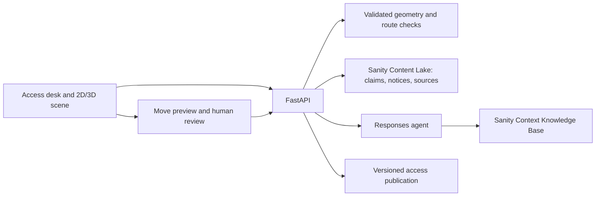

# Spatialize Access Desk

Adds sourced access claims, dated closures, corridor screening, obstacle previews,
and reviewed layout publication to Spatialize's existing geometry and WebMCP surface.

## Run locally

Requirements: Node 22+, Python 3.11+, and uv. From the repository root:

```powershell
npm ci
uv sync --project backend --extra dev
npm run dev:access
```

Open http://localhost:4174/#studio. The API runs on port 8788. The launcher uses
the Vite proxy; leave `VITE_API_BASE_URL` empty for this local setup. To use an
existing Python environment, set `SPATIALIZE_PYTHON` to its Python executable.
Local storage needs one API worker. Local fixtures require no model or Sanity keys.

## Two-minute demo

The redesigned studio puts the live model beside the access workflow. Open
**Evidence** for citations, **Rehearse an obstacle move** for previews and review,
**Source & venue tools** for upload and voice, and **Scene & extraction details**
for the original geometry review queue. The **Evidence agent** block sends your
question to an agent that reads the venue's Sanity Context Knowledge Base; it is
on whenever the server has a Context endpoint. The route caption shows
**Not checked** until an access check returns a verdict.

1. Check Learning studio at 800 mm: **CLEAR** for the stored route checks.
2. Request 1300 mm: **BLOCKED** by the 1200 mm studio doorway.
3. Check Gallery one at 800 mm: **BLOCKED** by the trolley.
4. Open **Rehearse an obstacle move** and preview moving the trolley to Gallery one,
   X=13.5, Z=5.3 metres. The published
   location remains unchanged; a mint ghost shows the candidate placement.
5. Submit and approve with a reviewer reason. Access version increments and the
   decision persists after reload. A new source records the approved placement.
6. Check Quiet room: **UNKNOWN**. The doorway evidence is uncertain and the
   venue guide disagrees with the disputed visitor report. Both remain visible.
7. Preview X=7.1, Z=2.7: the footprint does not fit the room and is rejected.
8. With the Evidence agent on, ask "Is the quiet room step-free?" and check the
   Quiet room. The computed verdict appears first. The agent then reads the
   Knowledge Base and sets the venue guide and the disputed visitor report side
   by side; it cannot change the verdict. **Context retrieval record** lists each
   MCP call with its arguments and what it returned.

Harbor Arts and all seeded reports, notices, and obstacles are fictional fixtures.
The sidebar labels this even when these documents are hosted in Sanity.

## Connected Sanity project

The standalone Studio is configured for project **Divij (`tubqyqod`)**, dataset
**`production`**. Hosted editor: https://spatialize-tubqyqod.sanity.studio/.
The root Vite app continues querying Sanity through the Python API; no Sanity
token is sent to the frontend. Local credentials are in the ignored root `.env`.
`sanity/.env.local` contains only public project coordinates.

From the root, with the backend environment active:

```powershell
python scripts/check-sanity.py
python scripts/sanity-command.py schemas deploy
python scripts/seed-sanity.py --write
python scripts/sanity-command.py deploy --url spatialize-tubqyqod --schema-required --yes
npm run dev:access
# Separate terminal, if you want a local editor:
npm run dev:studio
```

The CLI wrapper passes the project token through the child environment and
redacts it from output. Seed writes preserve existing documents and human edits.
The local Studio origin `http://localhost:3333` is already allowed by the project.
Studio sign-in uses your Sanity user account, separately from the server token.

Live verification passed: 800 mm studio CLEAR, 1300 mm BLOCKED, gallery trolley
BLOCKED, preview without publication, reviewed move persisted at access v2 in
Sanity, and quiet-room UNKNOWN with conflicting sources. See
`sanity-live-verification.json`. A diagnostic run and its explicitly synthetic
review source remain in the dataset as verification evidence.

## Sanity Context Knowledge Base

The evidence agent reads the Knowledge Base **Spatialize - Harbor Arts access
evidence** (`kbecyKU3h9k8`, organization `ottnv0qew`) through the Knowledge Base
MCP endpoint `spatialize-access-evidence`.

- **Built from structured content, not pages.** [`sanity/knowledge-base.groq`](sanity/knowledge-base.groq)
  selects the venue's `accessSource` documents and joins onto each one the
  claims, dated notices and obstacles that cite it, with their review status.
  An index of the source text alone would not know that the threshold report is
  *disputed* or that a closure *ended* on 21 September. The projection carries both.
- **Visitor text stays out.** Review records written through the public app
  (`review-*` sources) are excluded, so nothing a visitor types reaches the agent.
- **Context found the conflict on its own.** The first build filed a critical
  conflict: the venue guide says the quiet-room doorway is step-free, while the
  visitor report says it has a raised threshold. Spatialize keeps that dispute
  open, so no side was chosen. Instead the Knowledge Base carries a standing
  instruction to show both claims with their source, date and status and never
  settle them, and the conflict was dismissed under that instruction. The
  deterministic check reaches the same place from the structured claims: UNKNOWN.
- The build produced seven entries: access barriers, disputed reports, doorway
  access, facilities notices, review status, venue guide and visitor reports.

Knowledge Bases belong to the organization, so they are managed with a Sanity
user session (`npx sanity login` in `sanity/`), not the project token:

```powershell
python scripts/context-knowledge-base.py --knowledge-base <uuid>   # rebuild after editing sources
python scripts/context-knowledge-base.py --organization <org-id>  # create, import and build a new one
```

For a new Knowledge Base, create an MCP in the Context app whose **only** source
is that Knowledge Base. A dataset source switches the endpoint to GROQ mode and
the Knowledge Base is ignored. Then create an organization API token with
**Context: Viewer** access. Project tokens are rejected by Context endpoints.

## Configure another project

1. Create a project and dataset. Copy `.env.example` to `.env` and set
   `SANITY_PROJECT_ID`, `SANITY_DATASET`, and a server-only project read/write
   token in `SANITY_API_TOKEN`. No token uses a `VITE_` prefix.
2. In `sanity/`, run `npm ci`. Set `SANITY_STUDIO_PROJECT_ID` and
   `SANITY_STUDIO_DATASET` in that shell, then run `npm run dev`.
   Both Studio configs default to `tubqyqod`; the Studio variables override it.
3. Inspect `python scripts/seed-sanity.py --dry-run`. Run it with `--write` to
   create missing synthetic demo documents. Repeat runs preserve human edits.
4. Deploy the schema with `npm run schema:deploy` from `sanity/`.
5. Enable Context in your organization's Labs page, then build the Knowledge
   Base with `python scripts/context-knowledge-base.py --organization <org-id>`
   and create its MCP endpoint and token as described above. Review any conflicts
   it files: a disputed report must not become settled fact just because a venue
   reviewer declined it. Current notices are always queried from Content Lake.
6. Set `SANITY_CONTEXT_URL` to the endpoint URL the Context app shows, and the
   organization token in `SANITY_CONTEXT_TOKEN`. It is separate from the project
   write token.
7. Set `OPENAI_API_KEY` and, if needed, `SPATIALIZE_OPENAI_AGENT_MODEL` to a
   model that supports Responses remote MCP. Restart the API.
8. Ask the Evidence agent a question and open the retrieval record. It must show
   a successful `knowledge_base_read`; an `initial_context` call alone is not
   reported as retrieval.

The project ID is public; tokens never leave the server. A configured Sanity
failure returns an error. It never substitutes local fixtures.

## Architecture and boundaries



- Scene geometry stays in the existing run service. Access layouts have a separate
  publication version; answers carry both versions and a check timestamp.
- Routes are computed deterministically. A rectangular obstacle is checked
  against a corridor around each straight route segment using exact segment-to-
  footprint distance. Rotation and footprint containment are checked on placement.
- This screens the stored route, not every possible route. It does not assess
  turning space, slope, wall clearance, headroom, or unrecorded obstacles. The UI
  displays this scope. CLEAR is a screening result, not an accessibility certificate.
- Preview and proposal creation do not change the published obstacle layout.
  Approval revalidates against current scene and access versions. Declines remain
  in the review record. Reviewer authorization reuses `X-Venue-Token`.
- The API shares the geometry review lock for each run. Sanity publication also
  uses an `_rev` precondition; conflict means reload and preview again. The existing
  geometry storage and local fixtures assume one API worker. This release does
  not implement distributed transactions between object storage and Content Lake.
- Studio exposes sources, references, initial obstacles, published obstacle
  fields, and structured review records. Its internal serialized state is hidden
  and the publication document is read-only; use the review API for decisions.
- Retrieved model prose is a separate research note and cannot change the
  deterministic verdict. The UI includes actual MCP call outputs for inspection.

## Verify

```powershell
npm test
npm run lint
npm run build
npm run test:browser
uv run --project backend --extra dev pytest backend/tests -q
```

Browser tests start isolated local servers, disable external providers, and cover
clearance, conflict evidence, preview/approval/persistence, invalid placement, and
the evidence agent's answer and retrieval record (provider fields stubbed).
If using an existing Python environment, set `SPATIALIZE_TEST_PYTHON` for browser
tests. Chrome is required. `npm run evals` retains the optional paid model
evaluation; ordinary `npm test` excludes that network test.

## Credits

The access desk builds on Spatialize's floor-plan extraction, 3D twin, WebMCP
tools and geometry review queue (see the [README](README.md)). Alza's
obstruction checking and ArchMorph's synchronized human/agent model inspired
parts of the design; no code from either project was used.
