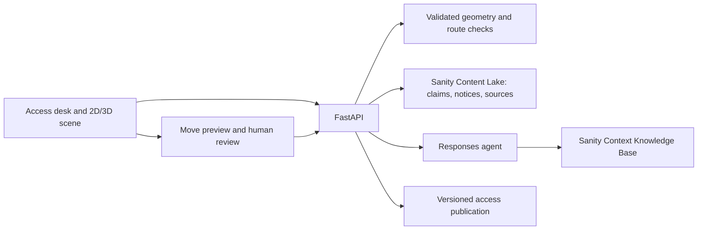

# Spatialize Access Desk

Adds sourced access claims, dated closures, corridor screening, obstacle previews,
and reviewed layout publication to Spatialize's existing geometry and WebMCP surface.

## Run locally

Requirements: Node 22+, Python 3.11+, and uv. From the repository root:

```powershell
npm ci
uv sync --project backend --extra dev
npm run dev:access
```

Open http://localhost:4174/#studio. The API runs on port 8788. The launcher uses
the Vite proxy; leave `VITE_API_BASE_URL` empty for this local setup. To use an
existing Python environment, set `SPATIALIZE_PYTHON` to its Python executable.
Local storage needs one API worker. Local fixtures require no model or Sanity keys.

## Two-minute demo

The redesigned studio puts the live model beside the access workflow. Open
**Evidence** for citations, **Rehearse an obstacle move** for previews and review,
**Source & venue tools** for upload and voice, and **Scene & extraction details**
for the original geometry review queue. **Source research (optional)** contains
the live-agent switch once Sanity is configured. The route caption shows
**Not checked** until an access check returns a verdict.

1. Check Learning studio at 800 mm: **CLEAR** for the stored route checks.
2. Request 1300 mm: **BLOCKED** by the 1200 mm studio doorway.
3. Check Gallery one at 800 mm: **BLOCKED** by the trolley.
4. Open **Rehearse an obstacle move** and preview moving the trolley to Gallery one,
   X=13.5, Z=5.3 metres. The published
   location remains unchanged; a mint ghost shows the candidate placement.
5. Submit and approve with a reviewer reason. Access version increments and the
   decision persists after reload. A new source records the approved placement.
6. Check Quiet room: **UNKNOWN**. The doorway evidence is uncertain and the
   venue guide disagrees with the disputed visitor report. Both remain visible.
7. Preview X=7.1, Z=2.7: the footprint does not fit the room and is rejected.

Harbor Arts and all seeded reports, notices, and obstacles are fictional fixtures.
The sidebar labels this even when these documents are hosted in Sanity.

## Connect Sanity later

1. Create a project and dataset. Copy `.env.example` to `.env` and set
   `SANITY_PROJECT_ID`, `SANITY_DATASET`, and a server-only project read/write
   token in `SANITY_API_TOKEN`. No token uses a `VITE_` prefix.
2. In `sanity/`, run `npm ci`. Set `SANITY_STUDIO_PROJECT_ID` and
   `SANITY_STUDIO_DATASET` in that shell, then run `npm run dev`.
   Studio's fallback `demo1234` is a build placeholder, not a working project.
3. Inspect `python scripts/seed-sanity.py --dry-run`. Run it with `--write` to
   create missing synthetic demo documents. Repeat runs preserve human edits.
4. Deploy the schema with `npm run schema:deploy` from `sanity/`.
5. Enable Context and Knowledge Bases in your Sanity organization's Labs.
   Build a Knowledge Base from this venue's `accessSource` documents. Suggested
   purpose: "Explain Harbor Arts access evidence, preserving unresolved
   visitor/venue disagreements and distinguishing synthetic examples from observations."
   Do not turn a disputed report into settled ground truth merely because a
   venue reviewer declined it. Inspect the generated entries and rebuild after
   editing sources; current notices are queried directly from Content Lake.
6. Create a Knowledge Base Context MCP endpoint scoped to this venue. Set
   `SANITY_CONTEXT_URL` and an organization Context Viewer token in
   `SANITY_CONTEXT_TOKEN`. This is separate from the project write token.
7. Set `OPENAI_API_KEY` and, if needed, `SPATIALIZE_OPENAI_AGENT_MODEL` to an
   available model supporting Responses remote MCP. Restart the API.
8. Enable "Research sources with the live agent" and verify actual
   `knowledge_base_read` calls in the retrieval record. An initial-context call
   alone is not reported as successful content retrieval.

The project ID is exposed for submission inspection, never the tokens. A
configured Sanity failure returns an error; it does not substitute local fixtures.
Live account access, tokens, and Knowledge Base indexing are **not verified**
until a real project is connected. Fixture mode alone is not a Path One entry.

## Architecture and boundaries



- Scene geometry stays in the existing run service. Access layouts have a separate
  publication version; answers carry both versions and a check timestamp.
- Routes are computed deterministically. A rectangular obstacle is checked
  against a corridor around each straight route segment using exact segment-to-
  footprint distance. Rotation and footprint containment are checked on placement.
- This screens the stored route, not every possible route. It does not assess
  turning space, slope, wall clearance, headroom, or unrecorded obstacles. The UI
  displays this scope. CLEAR is a screening result, not an accessibility certificate.
- Preview and proposal creation do not change the published obstacle layout.
  Approval revalidates against current scene and access versions. Declines remain
  in the review record. Reviewer authorization reuses `X-Venue-Token`.
- The API shares the geometry review lock for each run. Sanity publication also
  uses an `_rev` precondition; conflict means reload and preview again. The existing
  geometry storage and local fixtures assume one API worker. This release does
  not implement distributed transactions between object storage and Content Lake.
- Studio exposes sources, references, initial obstacles, published obstacle
  fields, and structured review records. Its internal serialized state is hidden
  and the publication document is read-only; use the review API for decisions.
- Retrieved model prose is a separate research note and cannot change the
  deterministic verdict. The UI includes actual MCP call outputs for inspection.

## Verify

```powershell
npm test
npm run lint
npm run build
npm run test:browser
uv run --project backend --extra dev pytest backend/tests -q
```

Browser tests start isolated local servers, disable external providers, and cover
clearance, conflict evidence, preview/approval/persistence, and invalid placement.
If using an existing Python environment, set `SPATIALIZE_TEST_PYTHON` for browser
tests. Chrome is required. `npm run evals` retains the optional paid model
evaluation; ordinary `npm test` excludes that network test.
