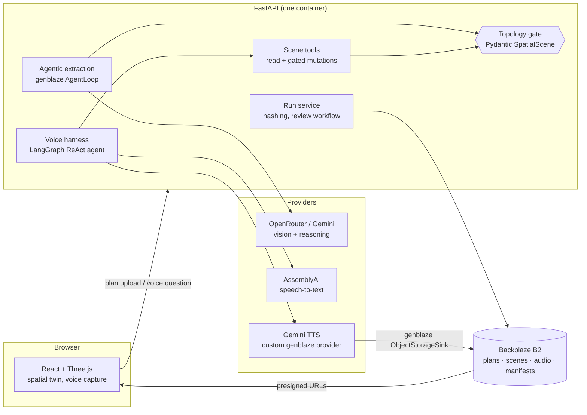
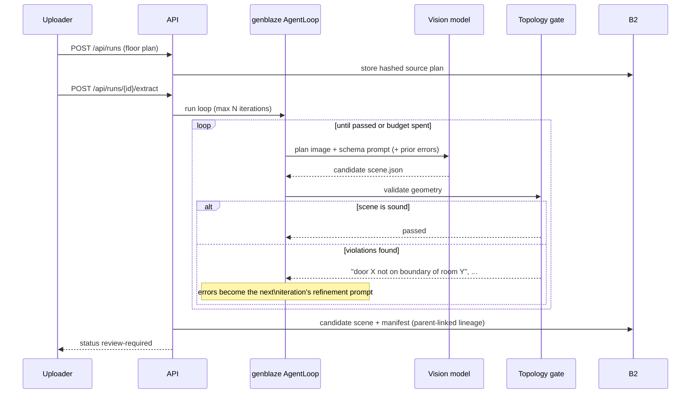
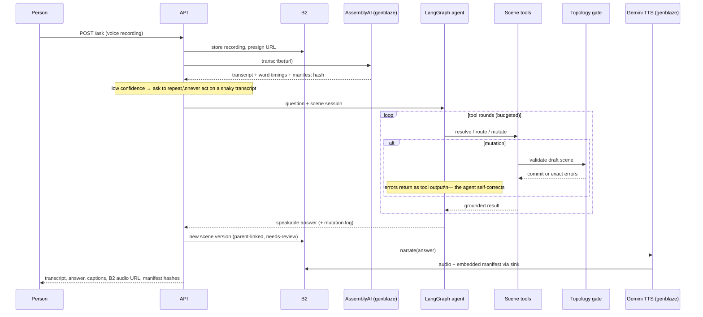
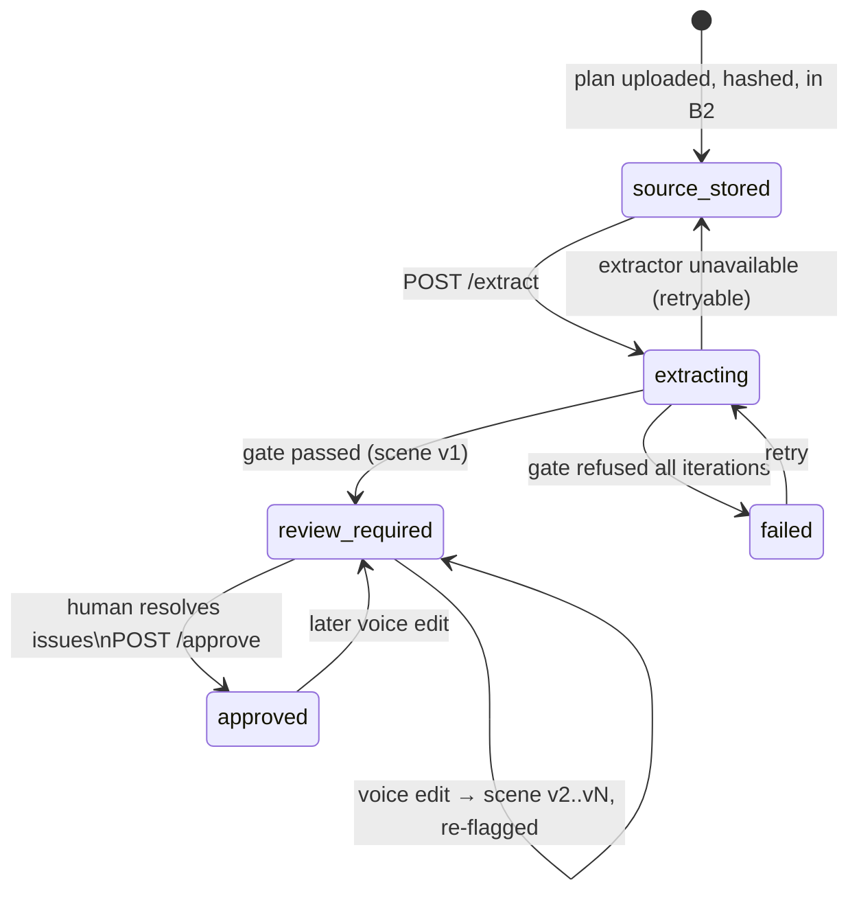

# Spatialize architecture

Spatialize is one FastAPI service + one React/Three.js web app + Backblaze B2,
with genblaze orchestrating every generative step. The design rule throughout:
**models propose, validators dispose** — no AI output reaches the scene or the
user without passing a deterministic gate.

## System overview



## The agentic extraction loop

A genblaze `AgentLoop` composes a pipeline factory with an **Evaluator**. Ours
is not an LLM judge — it is the same deterministic geometric validator that
guards every write. Failed attempts feed their exact errors back as the next
prompt, and every iteration is `parent_run_id`-linked in manifest lineage.



Checks the gate enforces (both in Zod on the client and Pydantic on the API):

- every polygon point inside scene bounds; unique entity ids
- every door on the boundary polyline of each room it connects (±0.15 m)
- route-edge distance equals node geometry (±10 %)
- cross-room edges reference a door that connects both rooms and lies on the segment
- accessible edges never pass through inaccessible doors
- route nodes inside their declared room; pixel↔metre scale consistency

## The voice loop



Guardrails in the harness: answers come only from tool results; ambiguous
references trigger a clarifying question instead of action; severed-route
warnings **must** be spoken; provider failures degrade (captions + on-device
speech) rather than fail the answer; tool-round and rate budgets cap every
conversation.

## Run lifecycle



## What lands in B2

```
spatialize/
├── runs/public/{date}/{run_id}/
│   ├── source/plan.png              # hashed original
│   ├── run.json                     # run record
│   ├── scene/candidate.json         # first gated extraction
│   ├── scene/versions/v0002.json    # every voice edit, parent-linked
│   ├── scene/approved.json          # human-approved publish
│   └── voice/questions/*.wav        # what was asked
├── generated/runs/{date}/{run_id}/  # genblaze ObjectStorageSink
│   ├── assets/*.wav                 # narrated answers
│   └── manifest.json                # SHA-256 canonical provenance
└── run-index/{run_id}.json          # O(1) run lookup
```

Voice edits carry `method: "human"` evidence quoting the spoken transcript, so
an auditor can trace any vertex to either a model manifest or a human utterance.

## Module map

| Path | Responsibility |
|---|---|
| `backend/spatialize_api/models.py` | `SpatialScene` contract + topology validator (the gate) |
| `backend/spatialize_api/workflow.py` | run lifecycle, scene versioning, review-gated approval |
| `backend/spatialize_api/agents/extraction.py` | AgentLoop factory + evaluator, vision providers (OpenRouter/Gemini) |
| `backend/spatialize_api/agents/tools.py` | scene reads, Dijkstra routing, draft-validate-commit mutations |
| `backend/spatialize_api/agents/voice.py` | LangGraph harness, guardrail prompt, provider fallbacks |
| `backend/spatialize_api/media/` | genblaze pipelines: STT, TTS provider, B2 sink |
| `backend/spatialize_api/storage.py` | run store: local disk or B2 (S3 API, presigned URLs) |
| `src/domain/spatial-scene.ts` | the same contract in Zod for the client |
| `src/components/SpatialCanvas.tsx` | deterministic Three.js compilation of a scene |
| `src/lib/routes.ts` | client-side accessible-route rehearsal |
